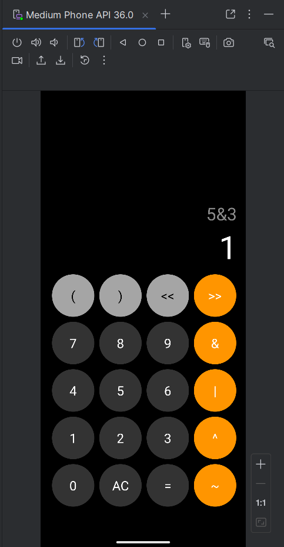
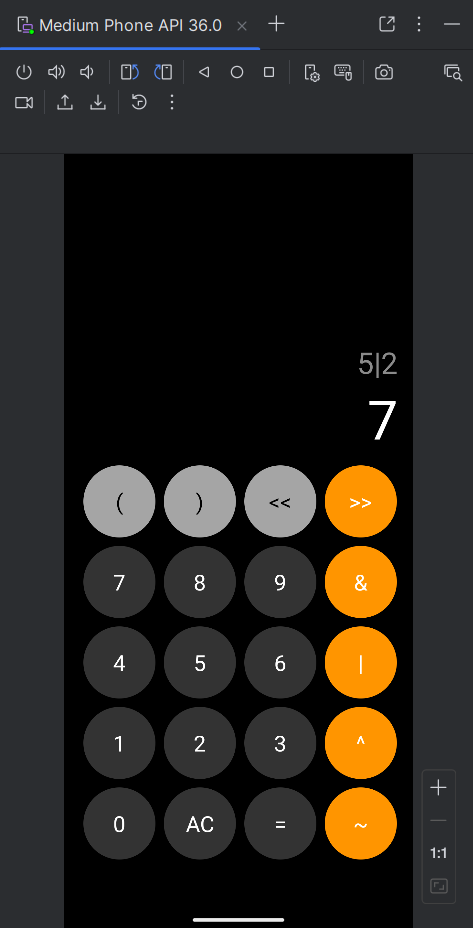
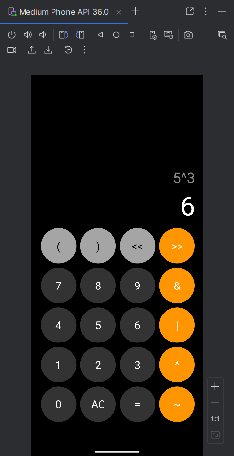
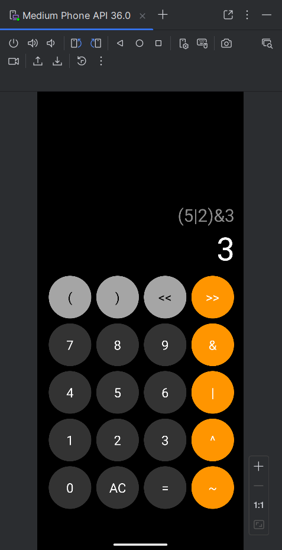
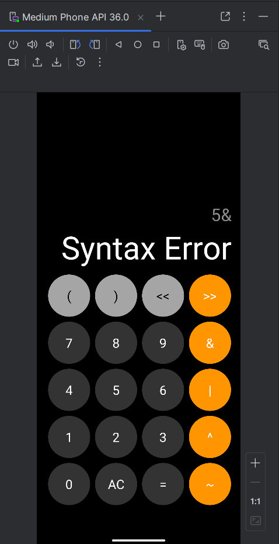

# Android Bitwise Calculator

A mobile bitwise calculator app built with Java and Android Studio. This project features a clean iPhone-inspired calculator interface and supports common bitwise operations.

## Overview

Android Bitwise Calculator is an Android application that evaluates bitwise expressions. It supports AND, OR, XOR, NOT, left shift, right shift, and parentheses.

This project was cleaned and organized for public portfolio use. It includes a polished calculator UI, structured Java code, input validation, expression history, and syntax error handling.

## Features

- iPhone-inspired calculator interface
- Bitwise AND operation
- Bitwise OR operation
- Bitwise XOR operation
- Bitwise NOT operation
- Left shift operation
- Right shift operation
- Parentheses support
- Expression history display
- Syntax error handling
- Input length validation
- Clean Java code structure

## Technologies Used

- Java
- Android Studio
- Android SDK
- Gradle
- XML Layouts
- Material Android Theme

## Supported Operations

| Operation | Symbol | Example | Result |
|---|---|---:|---:|
| Bitwise AND | `&` | `5 & 3` | `1` |
| Bitwise OR | `|` | `5 | 2` | `7` |
| Bitwise XOR | `^` | `5 ^ 3` | `6` |
| Bitwise NOT | `~` | `~5` | `-6` |
| Left Shift | `<<` | `3 << 2` | `12` |
| Right Shift | `>>` | `8 >> 1` | `4` |
| Parentheses | `( )` | `(5 | 2) & 3` | `3` |

## Project Structure

```text
android-bitwise-calculator/
├── app/
│   ├── src/
│   │   └── main/
│   │       ├── java/
│   │       │   └── com/
│   │       │       └── timnieto/
│   │       │           └── bitwisecalculator/
│   │       │               └── MainActivity.java
│   │       ├── res/
│   │       │   ├── drawable/
│   │       │   │   ├── circle_dark.xml
│   │       │   │   ├── circle_light.xml
│   │       │   │   └── circle_orange.xml
│   │       │   ├── layout/
│   │       │   │   └── activity_main.xml
│   │       │   └── values/
│   │       │       ├── colors.xml
│   │       │       ├── dimens.xml
│   │       │       ├── strings.xml
│   │       │       ├── styles.xml
│   │       │       └── themes.xml
│   │       └── AndroidManifest.xml
│   └── build.gradle.kts
├── assets/
│   ├── sample-output.png
│   ├── sample-output2.png
│   ├── sample-output3.png
│   ├── sample-output4.png
│   ├── sample-output5.png
│   ├── sample-output6.png
│   ├── sample-output7.png
│   └── sample-output8.png
├── build.gradle.kts
├── settings.gradle.kts
└── README.md
```

## Screenshots

### Bitwise AND

`5 & 3 = 1`



### Bitwise OR

`5 | 2 = 7`



### Bitwise XOR

`5 ^ 3 = 6`



### Bitwise NOT

`~5 = -6`


### Left Shift

`3 << 2 = 12`


### Right Shift

`8 >> 1 = 4`


### Parentheses

`(5 | 2) & 3 = 3`



### Syntax Error Handling

`5 & = Syntax Error`



## How to Run

1. Clone the repository:

```bash
git clone https://github.com/TimNieto/android-bitwise-calculator-app.git
```

2. Open the project in Android Studio.

3. Let Android Studio sync the Gradle files.

4. Start an Android emulator or connect an Android device.

5. Run the app from Android Studio, or use the command line.

## Build Command

On Windows PowerShell:

```powershell
.\gradlew clean assembleDebug
```

Expected output:

```text
BUILD SUCCESSFUL
```

## Install Command

```powershell
.\gradlew installDebug
```

## Sample Test Cases

| Input | Expected Output |
|---|---:|
| `5 & 3` | `1` |
| `5 | 2` | `7` |
| `5 ^ 3` | `6` |
| `~5` | `-6` |
| `3 << 2` | `12` |
| `8 >> 1` | `4` |
| `(5 | 2) & 3` | `3` |
| `5 &` | `Syntax Error` |

## Code Notes

The main calculator logic is handled in `MainActivity.java`.

The app uses a custom expression parser to evaluate bitwise expressions. The parser separates expression handling into methods for operator precedence, including OR, XOR, AND, shift operations, unary operations, parentheses, and number parsing.

## OOP Concepts Used

- Encapsulation through private fields and helper methods
- A nested parser class for expression evaluation
- Separation of UI event handling and calculation logic
- Method-based organization for readable and maintainable code

## Database Notes

This project does not use a database. All calculations are handled locally inside the app.

## Future Improvements

- Add binary input and output modes
- Add decimal, binary, and hexadecimal display modes
- Add saved calculation history
- Add more unit tests for expression parsing
- Improve landscape layout support

## License

This project is for educational and portfolio purposes only. All rights are reserved.
You may view the source code, but you may not copy, modify, distribute, or use this code without permission from the author.

## Author

Created by Tim Nieto.
